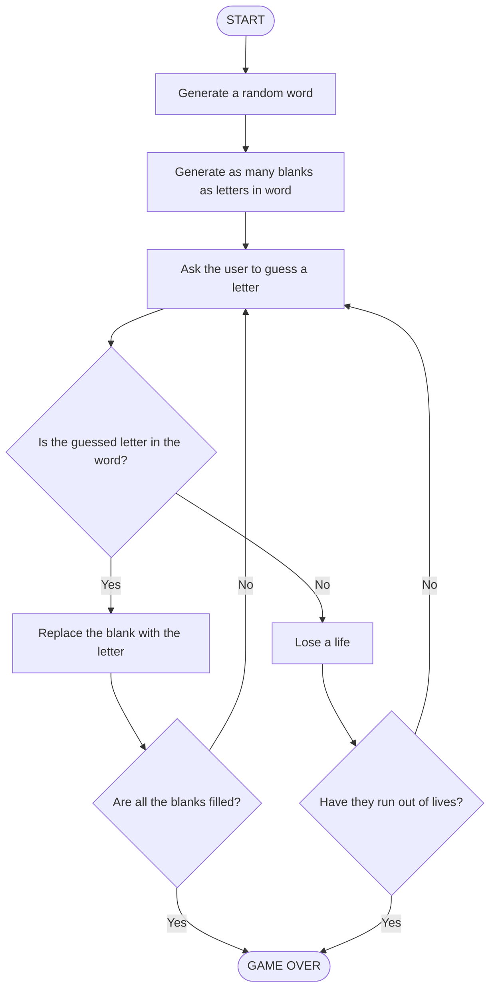
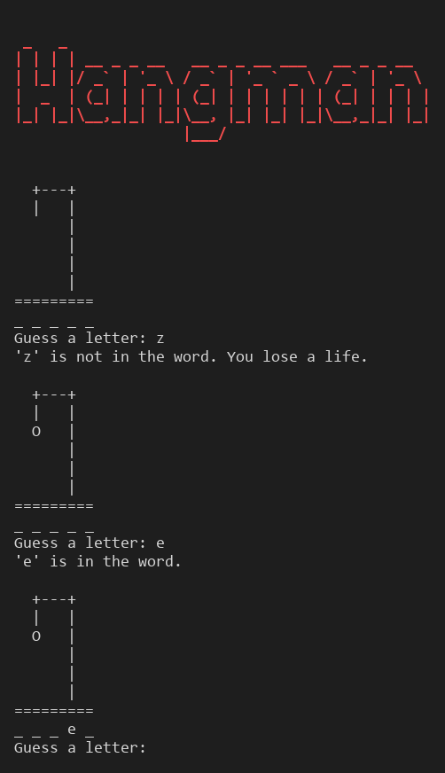

# 🚀 Hangman

A beginner-friendly Python program that lets you play Hangman in the terminal against a randomly chosen word.

## 📚 Table of Contents

- [Overview](#-overview)
- [Requirements](#-requirements)
- [Setup](#-setup)
- [Run](#-run)
- [Tests](#-tests)
- [License](#-license)
- [Links](#-links)

## 🧭 Overview

Day 7 of Udemy's *100 Days of Code™: The Complete Python Pro Bootcamp*. The game is built in five steps that follow the course:

1. Picking a random word and checking answers
2. Replacing blanks with guesses
3. Checking if the player has won
4. Keeping track of the player's lives
5. Improving the user experience *(this step)*

The flowchart from the course:



What each step adds:

- **Step 1:** pick a random word, ask for one letter and say whether it is in the word.
- **Step 2:** show the word as blanks (`_ _ _ _ _`); a correct guess replaces every matching blank.
- **Step 3:** keep asking for letters until every blank is filled, then print "You win!".
- **Step 4:** start with 6 lives; every wrong guess costs one. At 0 lives the game ends with "You lose" and reveals the word.
- **Step 5:** a colored ASCII-art title (colors are skipped when the output is not a terminal or the `NO_COLOR` environment variable is set), an ASCII-art gallows that grows with each wrong guess, a friendly message for letters you already guessed, and input validation (only a single letter is accepted). These two are additions that are not in the flowchart.



The game logic (`src/hangman/game.py`) is separate from the input/output (`src/hangman/main.py`), and all constants live in `src/hangman/constants.py`.

## 📋 Requirements

- Python 3.13 or newer
- No runtime dependencies (the standard library is enough)
- `pytest` (only for running the tests)
- [Doxygen](https://www.doxygen.nl/) (optional, to build the API documentation)

## 🛠️ Setup

Create and activate a local virtual environment named `.venv`, then install the project in editable mode together with the test extra.

Windows (PowerShell):

```powershell
python -m venv .venv
.\.venv\Scripts\Activate.ps1
```

Windows (cmd):

```bat
python -m venv .venv
.venv\Scripts\activate.bat
```

macOS / Linux / Git Bash:

```bash
python3 -m venv .venv
source .venv/bin/activate        # Git Bash on Windows: source .venv/Scripts/activate
```

Then install:

```bash
python -m pip install --upgrade pip
python -m pip install -e ".[test]"
```

Run `deactivate` to leave the environment.

The `.env` file (access tokens for repository tooling) is ignored by git and is not needed to run the game.

To build the API documentation with Doxygen (output in `docs/api`):

```bash
doxygen Doxyfile
```

## ▶️ Run

```bash
python -m hangman
```

or, after installing:

```bash
hangman
```

## 🧪 Tests

```bash
python -m pytest
```

## 📄 License

GNU Affero General Public License v3.0 or later (AGPL-3.0-or-later). See [LICENSE](LICENSE).

## 🔗 Links

- [Repository](https://git.tirsystem.com/Tirsvad-Udemy-100_days_of_code/007-Hangman)
- [Documentation](https://git.tirsystem.com/Tirsvad-Udemy-100_days_of_code/007-Hangman#readme)
- [Issue tracker](https://git.tirsystem.com/Tirsvad-Udemy-100_days_of_code/007-Hangman/issues)
